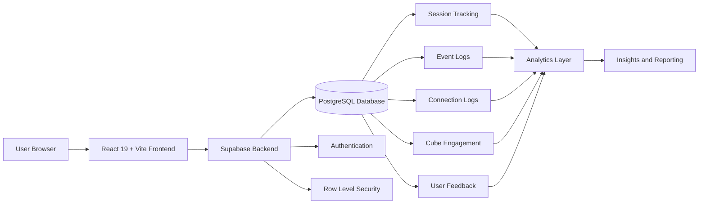

# Cube Interactive Game  
### An Interactive Web-Based Storytelling System

A research-driven interactive storytelling platform where users construct narratives by manipulating 3D cubes on a dynamic canvas.

---

## Overview

The Cube Interactive Game reimagines storytelling as an interactive and participatory experience. Instead of consuming predefined narratives, users actively create stories by selecting, rotating, and connecting cubes representing narrative elements.

Each cube contains six faces with different story fragments. Users build coherent narratives through spatial arrangement and graph-based connections.

---

## Live Demo

https://cube-interactive-game.vercel.app/

---

## Features

### 1. Interactive Canvas
- Drag and reposition cubes freely  
- Spatial storytelling representation  
- Phase-based structured layout (5 phases, 25 cubes)  

### 2. 3D Cube Interaction
- CSS-based 3D cube rendering  
- Multi-axis rotation  
- Supports mouse, touch, and button controls  

### 3. Graph-Based Story Construction
- Sequential cube connections  
- Directed narrative flow  
- Constraints enforced:
  - No self-loop
  - Single incoming and outgoing connection
  - Cycle prevention  

### 4. Hybrid Storytelling System
- Narrative fragments across cube faces  
- User-driven story construction  
- Combines interaction with creativity  

### 5. Research-Grade Analytics
Tracks:
- Cube interactions  
- Drag and rotation events  
- Session lifecycle  
- Connection patterns  

Enables behavioral analysis and storytelling research.

### 6. Backend Feedback Collection System
- Post-session feedback form (name, rating, review)  
- Data stored in Supabase PostgreSQL database  
- Optionally linked to session identifiers  
- Enables:
  - User experience evaluation  
  - Qualitative + quantitative insights  
  - System improvement  

### 7. Secure Backend Architecture
- Supabase backend  
- PostgreSQL database  
- Authentication support  
- Row Level Security (RLS)  

### 8. Onboarding and UX
- Guided onboarding flow  
- Real-time toast notifications  
- Intuitive UI interactions  

---

## System Architecture



## Tech Stack

### Frontend
- React 19  
- Vite 7  
- JavaScript, JSX, CSS  
- Custom CSS 3D transforms  

### Backend
- Supabase  
- PostgreSQL  
- @supabase/supabase-js  

### Analytics
- SQL-based event tracking  

### Code Quality
- ESLint  

---

## Database Design

### Key Components

- Session Tracking → lifecycle events  
- Event Logs → user interactions  
- Connection Logs → narrative graph  
- Cube Engagement → interaction depth  
- User Feedback → ratings and reviews  
- Analytics Layer → insights generation  

---

## Installation

### Clone repository
```bash
git clone https://github.com/AngelG05/Cube-Interactive-Game.git
cd Cube-Interactive-Game
```

### Install dependencies
```bash
npm install
```

### Setup environment variables
Create a .env file:
```bash
VITE_SUPABASE_URL=your_url
VITE_SUPABASE_ANON_KEY=your_key
```

### Run Project
```bash
npm run dev
```

---

## Future Improvements:

- AI-generated story enhancement
- Multiplayer collaboration
- Advanced analytics dashboard
- Voice-based interaction
- Mobile optimization
